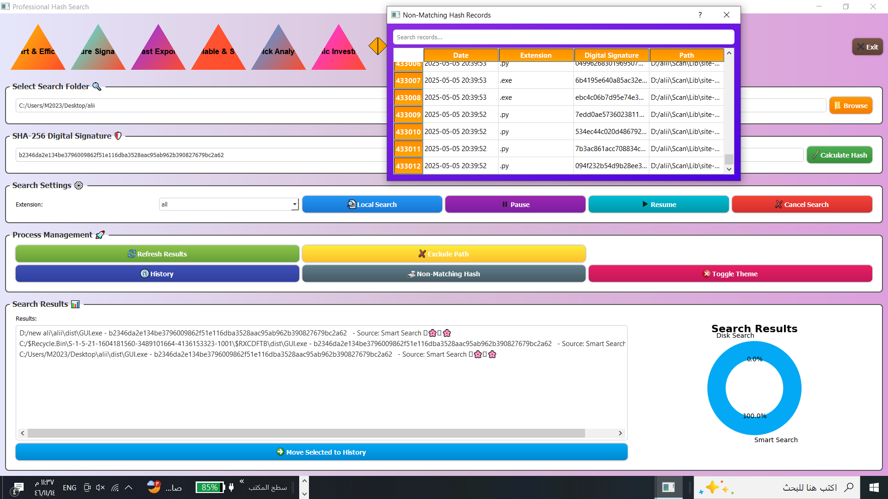
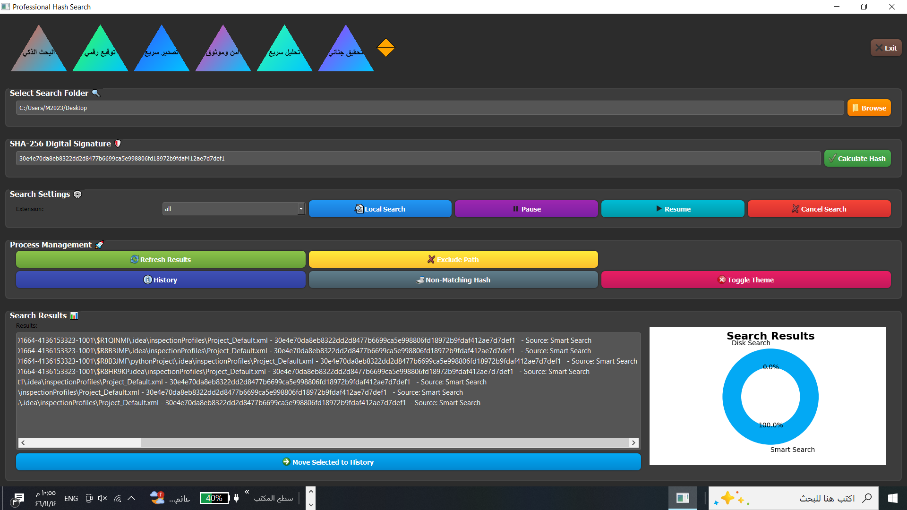
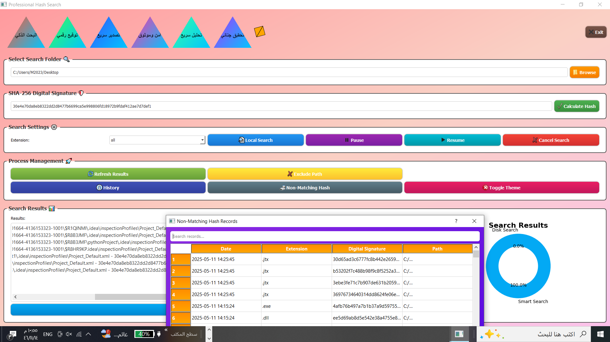
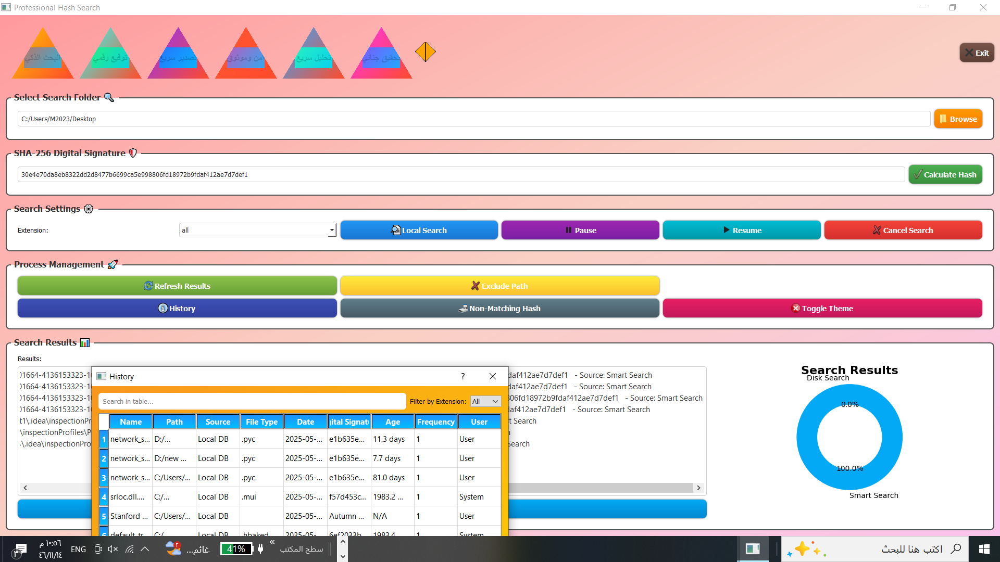

# Last Update Tracker

**أداة Python لفحص آخر التعديلات على الملفات داخل مسارات متعددة.**

تقوم هذه الأداة بتحليل مجلدات تختارها وتعرض وقت آخر تعديل تم على الملفات بطريقة منظمة باستخدام مكتبة `tabulate`.

## الميزات
- تدعم تحليل مسارات متعددة.
- استخراج وقت آخر تعديل لكل ملف.
- عرض النتائج بتنسيق جدولي.

## الاستخدام
1. عدّل قائمة `paths` في `lastupdate.py` لتحديد المجلدات.
2. شغّل الأداة باستخدام:

```bash
python lastupdate.py
```

## المتطلبات
- Python 3.7 أو أعلى
- مكتبة tabulate:  
```bash
pip install tabulate
```

## الترخيص
مرخصة برخصة MIT — استخدام حر مع الحفاظ على حقوق المؤلف.

## المطوّر
Ali Al-sha'abi 
Amran Unverisity
775229484


## لقطات من تشغيل الأداة





